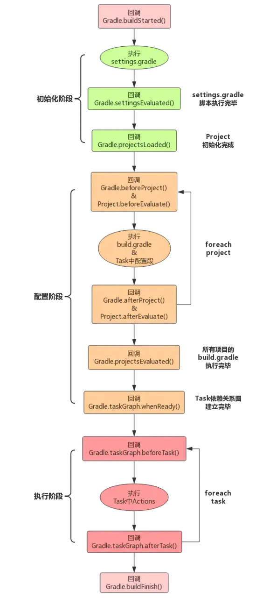

### 1. 开始之前

**[Gradle DSL 文档](https://docs.gradle.org/current/dsl/)**

Gradle基于Groovy,而Groovy基于Java,最后始终得运行在JVM之上.Gradle、build.gradle、settings.gradle之类的最终都会被搞成一个对象,然后才能执行.

- Gradle 对象: 每次执行`gradle taskName`时,Gradle都会默认构造出一个Gradle对象.在执行过程中,只有这么一个Gradle对象,一般很少去定制它.
- Project对象: 一个build.gradle就对应着一个Project对象.
- Settings对象: 一个settings.gradle就对应着一个Settings对象.

它们的生命周期节点如下:

//https://github.com/xfhy/Android-Notes

